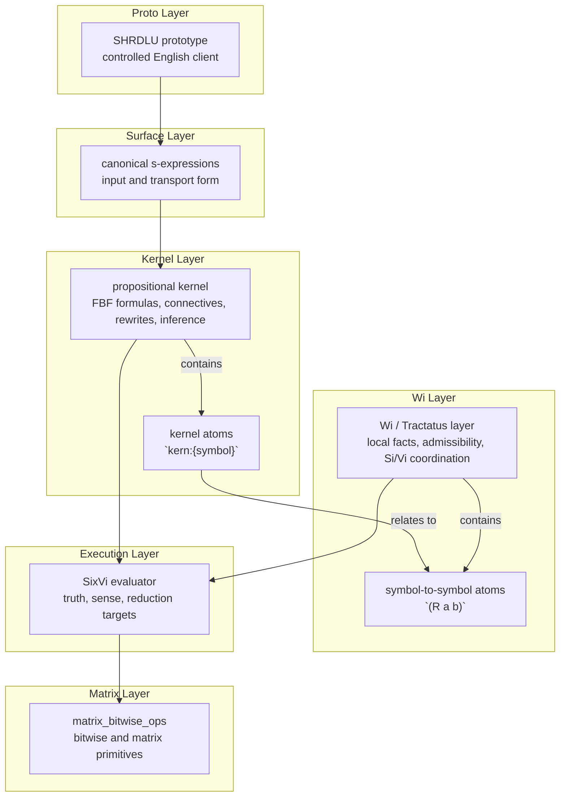

# Kernel Symbol Policy

This document defines the first stable distinction between **kernel symbols** and **Wi-level relations**.

## Purpose

Matrix needs a kernel that operationalizes facts and database-backed symbol spaces without forcing every useful relation to become hardcoded runtime behavior.

The rule is:

- the kernel contains only symbols whose semantics must be understood by the runtime itself
- `Wi` contains asserted relational content that the runtime should store, query, and infer over

In short:

- kernel = code-level semantics
- `Wi` = fact-level semantics

## Classification

### Kernel connectives

These belong in the kernel because they compose or transform propositions instead of naming domain facts:

- `and`
- `or`
- `not`
- `if`

### Kernel meta-relations

These should be kernel-significant because they operationalize symbol spaces across databases and ontologies:

- `instance`
- `equivalent`

Why:

- `instance` supports typing, admissibility, and query planning
- `equivalent` supports canonicalization, alias folding, and cross-source symbol unification

They may still appear as s-expressions, but their semantics are special to the kernel rather than just ordinary domain facts.

### Wi-level relation families

These should remain asserted content inside `Wi`:

- `has_property`
- `in_state`
- `part_of`
- `depends_on`
- `causes`
- `precedes`

Why:

- they describe world structure, not kernel mechanics
- they should live in knowledge bases, be queried like other facts, and remain replaceable by domain-specific vocabularies

### Wi-level temporary sugar

These should not enter the kernel as deep primitives:

- `event1`
- `event2`
- `event3`

They are useful as surface forms, but they look like arity-specific sugar rather than stable logical atoms.

Current policy:

- keep them out of the kernel
- if used, store them as Wi-level relation families
- later, consider lowering them into a more uniform event representation

## Table

| Symbol | Layer | Role | Stability |
| --- | --- | --- | --- |
| `instance` | kernel | meta-relation | keep |
| `equivalent` | kernel | meta-relation | keep |
| `and` | kernel | connective | keep |
| `or` | kernel | connective | keep |
| `not` | kernel | connective | keep |
| `if` | kernel | connective | keep |
| `has_property` | Wi | relation-family | keep |
| `in_state` | Wi | relation-family | keep |
| `part_of` | Wi | relation-family | keep |
| `depends_on` | Wi | relation-family | keep |
| `causes` | Wi | relation-family | keep |
| `precedes` | Wi | relation-family | keep |
| `event1` | Wi | relation-family | defer |
| `event2` | Wi | relation-family | defer |
| `event3` | Wi | relation-family | defer |

## Design consequence

The kernel should stay small.

It should know how to:

- normalize symbols
- classify forms
- compose propositions
- reason over typed and equivalent symbols

It should not hardcode broad ontological vocabularies such as causality, partonomy, or state unless a later design proves that they truly belong below `Wi`.

## Code surface

The current code-level policy lives in:

- `src/operational_model/kernel/symbol_policy.py`

That module is the first operational anchor for future lowering, database integration, and kernel execution work.

## Execution Layers

The current design direction is best described as nested operational layers.

## Atom Policy

To keep the kernel clean:

- anything fundamentally **symbol-to-symbol** should remain a relational atom in canonical form: `(R a b)`
- anything **internal to the kernel** and not naturally expressed as a symbol-to-symbol relation should use the explicit namespace `kern:{symbol}`

Examples:

- relational atom: `(instance perro mamifero)` or `(causes fuego humo)` when treated as Wi-level facts
- kernel atom: `kern:ready`, `kern:contradiction-flag`, `kern:false`

This keeps the bridge explicit between:

- the relational world stored in `Wi`
- the internal symbols used by the kernel for composition, normalization, and execution

## Symbol Spaces

`instance` and `equivalent` now point toward an explicit kernel notion of **symbol space**.

A symbol space is not just storage. It is the normalization domain where the kernel can:

- assert class membership with `instance`
- unify aliases and canonical names with `equivalent`
- recover canonical representatives before later DB, query, or Wi operations

This matters because a future database backend should preserve the same semantic operations even if the storage layer changes.

Current code surface:

- `src/operational_model/kernel/symbol_spaces.py`
- `src/operational_model/kernel/typed_assertions.py`
